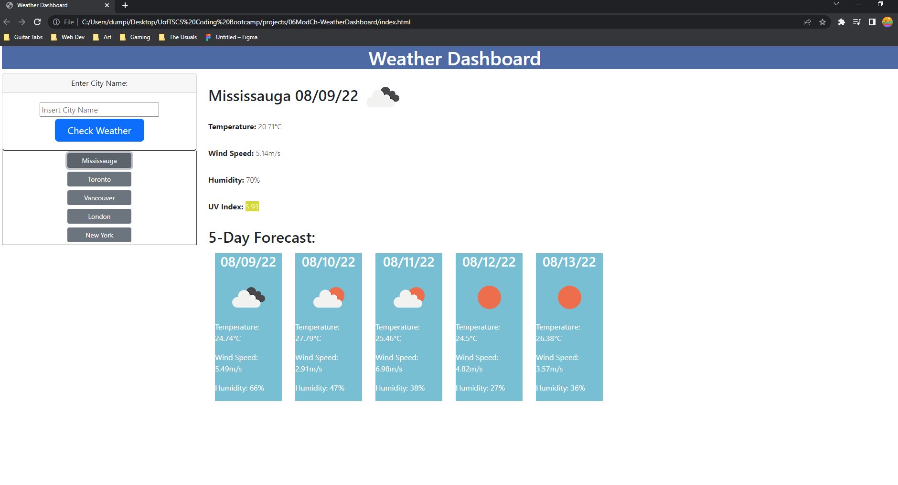

# Weather-Dashboard
UofTSCS Coding Bootcamp: Module 06: Weather Dashboard

## Purpose

A website that provides current weather and 5-day forecast for multiple cities. The website allows for users to revist a previous search. These features should allow the users to plan a trip accordingly.

## Built With

This website was built with:
* HTML
* CSS/Bootsrap
* Javascript
* OpenWeather API : https://openweathermap.org/api

# Website
* https://bryandumpit.github.io/Weather-Dashboard/

# Contribution

Made with ❤️ by Bryan Dumpit with help from OpenWeather One Call 3.0 API.

# Project Details
* index.html was written to provide container elements from which script.js would be able to interact with.
* script.js was written to call from api endpoints to retrieve weather data, which are then used to dynamically create elements for the user to interact with. 
    * weather data retrieved is stored to localStorage to allow the user to recall the results previously searched by clicking a recall button labelled with the city name searched.
* bootstrap was used to build a responsive webpage to different screen sizes
* OpenWeather One Call API 3.0 was used to retrieve weather data for different cities (based on input by user)
    * the js logic takes a city name input from the user and calls a geoposition endpoint from the openweather API and retrieve lat and lon data
    * the js logic then uses the lat and lon data to retrieve weather data from One Call 3.0 API

## User Story

AS A traveler
I WANT to see the weather outlook for multiple cities
SO THAT I can plan a trip accordingly

## Acceptance Criteria

* GIVEN a weather dashboard with form inputs:
* WHEN I search for a city
    *  THEN I am presented with current and future conditions for that city and that city is added to the search history
* WHEN I view current weather conditions for that city
    * THEN I am presented with the city name, the date, an icon representation of weather conditions, the temperature, the humidity, the wind speed, and the UV index
* WHEN I view the UV index
    * THEN I am presented with a color that indicates whether the conditions are favorable, moderate, or severe
* WHEN I view future weather conditions for that city
    * THEN I am presented with a 5-day forecast that displays the date, an icon representation of weather conditions, the temperature, the wind speed, and the humidity
* WHEN I click on a city in the search history
    * THEN I am again presented with current and future conditions for that city